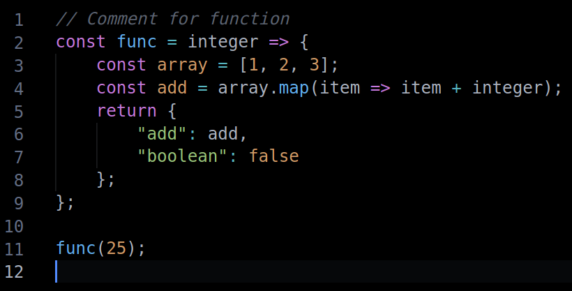

# Atom Just Black Theme

Visual Studio Code theme based on [Atom One Dark](https://github.com/akamud/vscode-theme-onedark) syntax colors and [Just Black](https://github.com/nurmohammed840/VSC.ext/tree/master/JustBlack) background colors.



Feel free to report an issue or leave any suggestions on [Github](https://github.com/dereckdamphouse/atom-just-black)!

## Note
If you are seeing very different colors, you may need to wait for VSCode to release an update. In the meantime, make sure to set the following setting:

```
"editor.semanticHighlighting.enabled": false
```

## Credits
[Atom](https://github.com/atom)
[Atom One Dark](https://github.com/akamud/vscode-theme-onedark)
[Just Black](https://github.com/nurmohammed840/VSC.ext/tree/master/JustBlack)